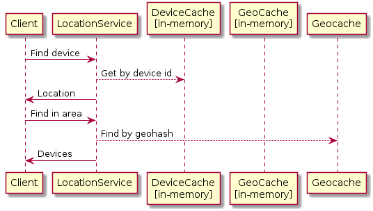
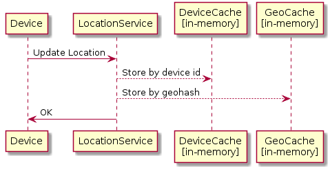

# Phase 1

Vertically scalable implementation with no external database dependencies.

Service receives location updates directly from devices and stores the data in memory caches.
The services uses two caches, a device cache (device_id -> location), and a geohash cache (geohash -> devices_in_geohash).

The service also provides [SSE](https://en.wikipedia.org/wiki/Server-sent_events) in order to alleviate polling and allow clients to subscribe to realtime events.

## Architecture

## Evaluation

### Pros

- Simpler deployment.
- Faster development time.
- In memory data stores are easier to mock and test.

### Cons

- Since data stores is embedded in memory, we cant scale it horizontally.
- Handling all data in memory might create a higher load / memory leaks.
- We used a simple cache as the store, it lacks many advanced features (e.g. GeoJSON) offered by other solutions.
